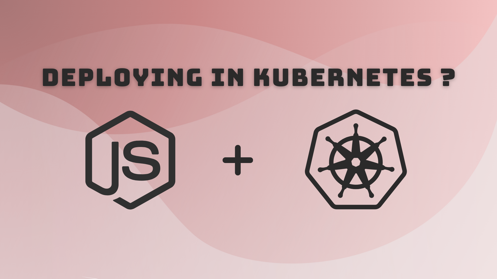

# Deploying Node App on Kubernetes Cluster

## >> Getting started



To get started with this project, run

```bash
git clone https://github.com/Vishakha-Sawra/k8s-nodejs-app
```

## >> Navigate to project directory and install dependencies:

```bash
cd k8s-nodejs-app
npm install
```

## >> Follow the documentation:

https://fewv.dev/lessons/deploy-nodejs-in-kubernetes/